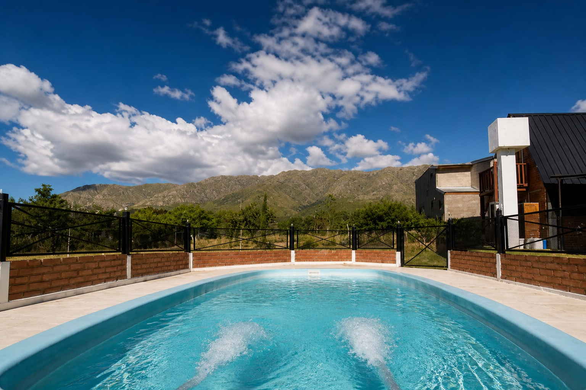
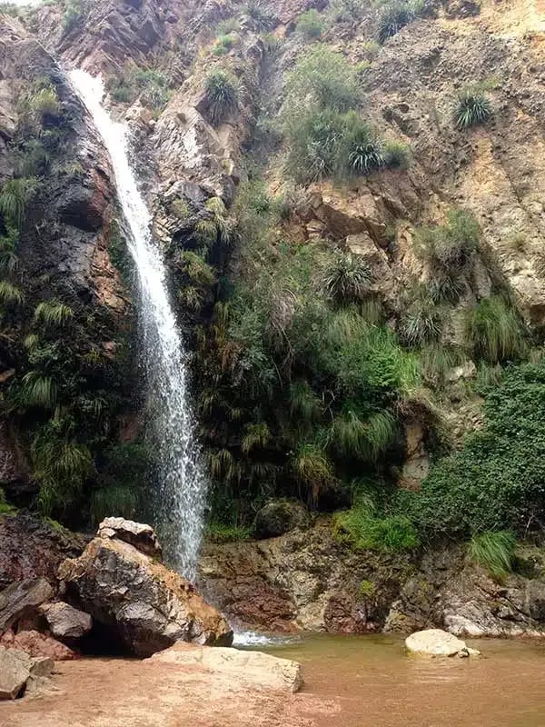

<div align="center">



# Cabañas La Esperanza

**Landing de reservas** para un complejo de cabañas en Villa Larca, San Luis.  
Al pie de los Comechingones. Reserva directa por WhatsApp.

[Vite](https://vite.dev/) · [React](https://react.dev/) · [TypeScript](https://www.typescriptlang.org/) · [Tailwind CSS v4](https://tailwindcss.com/)

<br />





</div>

---

## El proyecto

Sitio one-page pensado para convertir visitas en consultas: fotos reales del predio, servicios, qué hacer en la zona, ubicación y un formulario que arma el mensaje de WhatsApp.

**San Martín 973, Villa Larca, San Luis**  
WhatsApp [11 3393-9545](https://wa.me/5491133939545) · Instagram [@la_esperanza_alquiler](https://www.instagram.com/la_esperanza_alquiler/)

## Qué incluye

- Hero a pantalla completa con pileta y sierras
- Complejo de **varias cabañas**, no una sola unidad
- Galería con lightbox
- Lugares de Villa Larca y alrededores (Chorro de San Ignacio, Dique Piscu Yaco, Cascada Esmeralda y más)
- Formulario de consulta → WhatsApp
- Mapa, FAQ, SEO y datos estructurados
- Diseño responsive, botón de WhatsApp y CTA móvil

## Stack

| Capa | Tecnología |
| --- | --- |
| UI | React 19 + TypeScript |
| Build | Vite |
| Estilos | Tailwind CSS v4 |
| Tipografías | Cormorant Garamond + Outfit |
| Imágenes | Sharp (`npm run images`) |

## Cómo correrlo

```bash
npm install
npm run images
npm run dev
```

Abrí [http://localhost:5173/](http://localhost:5173/).

```bash
npm run build     # producción
npm run preview   # preview local del build
```

## Contenido

El copy, contacto, galería y lugares viven en `src/data/site.ts`.  
Las fotos originales van en `fotos/`; el script las deja listas en `public/images/`.

Antes de publicar, reemplazá el dominio placeholder `https://cabanaslaesperanza.com.ar` en:

- `index.html`
- `src/data/site.ts`
- `public/robots.txt`
- `public/sitemap.xml`
